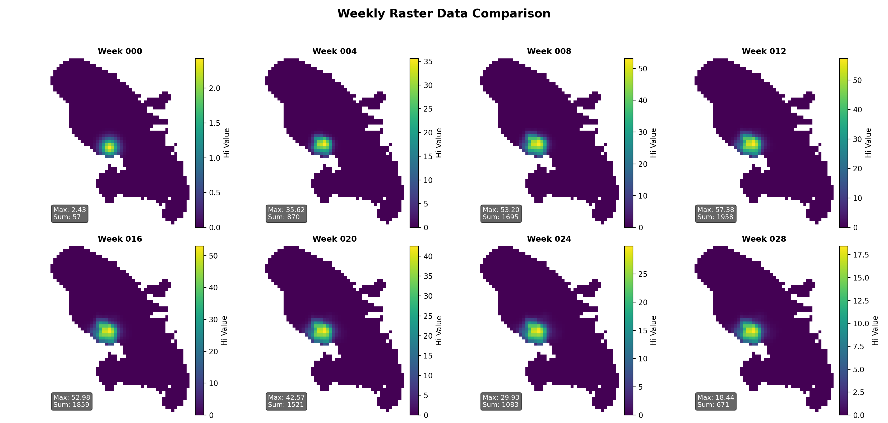

# Reaction–Diffusion Vector–Host Simulation (FiPy + GeoTIFF)

This project simulates a spatial (reaction–diffusion) vector–host system on a 2D raster grid using **FiPy** for PDE time-stepping and **rasterio** for GeoTIFF I/O. The main outputs are weekly infected-host density rasters plus a CSV time series summary.



## What this repo contains

- **PDE simulation script**: `Diffusion_reaction_equation.py`

  - Reads population raster (`Hu`) and control/mortality raster (`μ`)
  - Initializes infected hosts `Hi` from a seed point (optionally smoothed)
  - Simulates `Hi` (infected humans), `Vu` (uninfected vectors), `Vi` (infected vectors)
  - Exports weekly GeoTIFFs and a CSV summary

- **μ (mu) hotspot builder**: `mosquito_loss_function.py`
  - Builds a Gaussian hotspot `μ(x,y)` from a population raster and writes it as a GeoTIFF

## Model (high level)

State variables:

- `Hi`: infected host density
- `Vu`: uninfected vector density
- `Vi`: infected vector density

Dynamics (per script implementation):

- Diffusion on the grid (`delta1`, `delta2`)
- Reaction terms including infection coupling (`sigma1`, `sigma2`), mortality/control (`mu1`, `μ`), and a seasonal breeding rate `β(t)` implemented as an exponentially modified Gaussian (EMG).

## Requirements

Python 3.10+ recommended.

Core dependencies:

- `fipy`
- `rasterio`
- `numpy`
- `matplotlib` (optional; only if you generate plots/figures)

Install:

```bash
pip install fipy rasterio numpy matplotlib
```
